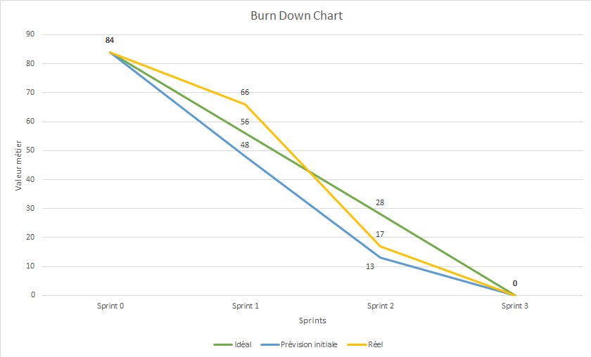

# Releases

- <a href="#r1">Release n°1 : 08/11/2019 + Sprint1.v0.1.0</a>
- <a href="#r2">Release n°2 : 22/11/2019 + Sprint2.v0.2.0</a>
- <a href="#r3">Release n°3 : 10/12/2019 + Sprint3.v0.3.0</a>

## Release n°3 

10/12/2019 + Sprint3.v0.3.0
Release : https://github.com/JSenjean/gr1_eq2_Release/releases

## Burn Down Chart

# User Stories achevées

| ID     | Description                                   | Difficulté | Priorité | Sprint |
|--------|-----------------------------------------------|------------|----------|--------|
| US11   | **En tant que** participant                   | 3          | HIGH     | 1      |
|        | **je peux** avoir une vue d'ensemble du projet depuis la page de gestion de projet, ce qui affiche les informations suivantes :
|        | - la liste des membres du projet
|        | - les demandes actuelles des utilisateurs pour rejoindre le groupe 
|        | - les invitations en attente, envoyées par le chef de projet aux utilisateurs
|        | - vue d'ensemble du sprint courant \(dates, tâches restantes\)
|        | - récapitulatif des tests \(% executé\)
|        | - le nom, la description et la visibilité du projet
|        | afin d'avoir une vue d'ensemble du projet
| US17   | **En tant que** participant                   | 5          | HIGH     | 2      |
|        | **je peux** cliquer sur un sprint, pour étendre son affichage et avoir accès à la liste des user stories correspondantes, des tâches à faire, des tâches en cours de réalisation, et des tâches terminées \(les tâches marquées comme terminées contribuent à augmenter le pourcentage d'accomplissement du sprint\)\. je peux également ajouter ou supprimer les user stories associées en cliquant sur les boutons correspondants
|        | **afin de** gérer en détail les tâches à réaliser durant le sprint
| US22   | **En tant que** chef de projet                | 3          | HIGH     |
|        | **je peux** ajouter un dépôt git de release dans la page de gestion de version \(ou page de release\)
|        | **afin de** rendre consultable l'historique des versions de release
| US23   | **En tant que** participant                   | 1          | HIGH     |
|        | **je peux** consulter la page de gestion de version
|        | **afin de** voir toutes les releases du projet
| US24   | **En tant que** participant                   | 3          | HIGH     |
|        | **je peux** ajouter/modifier une section de documentation sur la page dédiée en cliquant sur ajouter/modifier une documentation en renseignant :
|        | - Un nom
|        | - Une description
|        | - Une catégorie
|        | - \(Optionnel\) Un fichier \.md associé
|        | La date de dernière modification est affichée pour chaque élément de documentation\. Si la documentation n'a pas changé depuis 1, 2, 3 ou 4 semaines, l'élément dans la liste change de couleur \(vert, bleu, orange et rouge\)\.
|        | **afin de** indiquer qu'un élément de documentation est fait, et si il est ancien ou non \(et donc potentiellement obsolète\)
| US25   | **En tant que** participant                   | 3          | HIGH     |
|        | **je peux** ajouter/modifier/supprimer une catégorie de documentation sur la page dédiée en cliquant sur les boutons correspondants
|        | **afin de** organiser les différentes sections de documentation
| US26   | **En tant que** participant                   | 2          | HIGH     |
|        | **je peux** cliquer sur une section de documentation pour ouvrir le details ce qui permet de cliquer sur le bouton supprimer
|        | **afin de** supprimer de la liste les documentation obsolètes

# Tâches DONE correspondantes

| ID  | Nom                                         | Description                                                                                                                                                                                                                                                                                | Definition of Done                                                                                                               | Parents     | Coût (j/h) | Liaison US           | Développeur              | Etat  |
|-----|---------------------------------------------|--------------------------------------------------------------------------------------------------------------------------------------------------------------------------------------------------------------------------------------------------------------------------------------------|----------------------------------------------------------------------------------------------------------------------------------|-------------|------------|----------------------|--------------------------|-------|
| T1  | Docker                                      | Configurer Docker pour les releases du projet                                                                                                                                                                                                                                              | Pouvoir télécharger les sources du code et lancer un docker compose et vérifier le bon fonctionnement de l'application           | T0          | 1.5        | US1 - US29           | Guillaume                | DONE  |
| T2  | Travis                                      | Configurer Travis pour executer les tests a chaque push sur le dépot git de dev et de realease                                                                                                                                                                                             | Pouvoir configurer une automatisation des tests                                                                                  | T0          | 1.5        | US20 US21         | Guillaume                | DONE  |
| T3  | view/release.php                            | Créer l'affichage de la page dont : l'affichage des releases et de toutes les informations associées de GitHub                                                                                                                                                                             | Pouvoir se connecter et vérifier que la page comporte bien les dernières release de github                                       | T0          | 0.5        | US22 US23         | Mathieu                  | DONE  |
| T4  | model/release.php controller/release.php | Récupérer les informations des releases grâce a l'API Github pour pouvoir les afficher dans la page des releases                                                                                                                                                                           | Pouvoir se connecter et vérifier que la page comporte bien les dernières release de github                                       | T0          | 1          | US22 US23         | Mathieu                  | DONE  |
| T5  | view/doc.php                                | Créer l'affichage de la documentation que se construit d'une manière similaire à la page des tests : affiche les sections de doc, avec des informations et si elle est faite ou pas grâce à deux boutons, on peut aussi la rendre obsolète ainsi qu'upload des fichiers                    | Pouvoir se connecter et créer des sections de documentations et vérifier que l'on peut les rendre valide ou non et les supprimer | T0          | 0.5        | US24 US25 US26 | Guillaume                | DONE  |
| T6  | model/doc.php controller/doc.php         | Écrire model et controller permettant de créer des sections de documentation en renseignant son nom et sa description, créer les filtres d'affichage des sections, les boutons de passage et de suppression, une barre de progression représentant le pourcentage de documentation écrite. | Pouvoir se connecter et créer des sections de documentations et vérifier que l'on peut les rendre valide ou non et les supprimer | T0          | 0.5        | US24 US25 US26 | Guillaume                | DONE  |
| T7  | model/sprints.php controller/sprints.php | Ajouter la laison des US dans les sprints via le bouton "Ajouter User Story", et ajouter dans lla création et modification de task la liaison à une ou plusieurs userstory                                                                                                                 | Pouvoir se connecter et lier des User Stories à un sprint puis à une tâche                                                       | T0          | 1.5        | US17                 | Joël                     | DONE  |
| T8  | model/test.php controller/test.php       | Ajouter le changement d'état des tests en obsolète quand une nouvelle release est ajouté.                                                                                                                                                                                                  | Ajouter une release et vérifier que les tests deviennent obsolète                                                                | T0          | 0.5        | US21                 | Mathieu                  | DONE  |
| T12 | Documentation                               | Ecrire la doc des fonctions de model/                                                                                                                                                                                                                                                      | Pouvoir consulter la documentation des fonctions de model/                                                                       | T1 - T9     | 1          | US1 - US29           | Guillaume, Joël, Mathieu | DONE  |
| T13 | Manuels                                     | Ecrire les manuels utilisateur, administrateur et de test                                                                                                                                                                                                                                  | Pouvoir consulter les manuels utilisateur, administrateur et de test                                                             | T1 - T9     | 0.5        | US1 - US29           | Guillaume                | DONE  |

# User Stories reportées au sprint 2

Seules des tâches de tests n'ont pas été terminées. Les fonctionnalités métiers et leurs US associées ont été achevées.

# Tâches non achevées à la fin du sprint 3

| ID  | Nom                                                                                                                                                                                                                                                     | Description                                                                                                                                                                                                                                                                                                                                                                                                                                                                                                                                                                                                                                                                  | Definition of Done                                                                                                                                                                                                                                                                                                                                                                         | Parents | Coût (j/h) | Liaison US        | Développeur | Etat  | Maquette                                                           |
|-----|---------------------------------------------------------------------------------------------------------------------------------------------------------------------------------------------------------------------------------------------------------|------------------------------------------------------------------------------------------------------------------------------------------------------------------------------------------------------------------------------------------------------------------------------------------------------------------------------------------------------------------------------------------------------------------------------------------------------------------------------------------------------------------------------------------------------------------------------------------------------------------------------------------------------------------------------|--------------------------------------------------------------------------------------------------------------------------------------------------------------------------------------------------------------------------------------------------------------------------------------------------------------------------------------------------------------------------------------------|---------|------------|-------------------|-------------|-------|--------------------------------------------------------------------|
| T9  | tests unitaires de model/documentation      | Ecrire les tests unitaires pour tester toutes les fonctions de model/documentation.                                                                                                                                                                                                        | Pouvoir lancer les tests automatisés qui renvoient le succès ou l'échec du test de toutes les fonctions.                         | T5          | 0.5        | US1 - US29           |                          | TODO  |
| T10 | tests unitaires de model/release.php        | Ecrire les tests unitaires pour tester toutes les fonctions de model/documentation.                                                                                                                                                                                                        | Pouvoir lancer les tests automatisés qui renvoient le succès ou l'échec du test de toutes les fonctions.                         | T4          | 0.5        | US1 - US29           |                          | TODO  |
| T11 | tests_validation/                           | Ecrire les tests de validations pour les US 10 à 26                                                                                                                                                                                                                                        | Pouvoir lancer le script de test sur toutes les User Stories et consulter les résultats dans les logs                            | T1 - T9     | 1.5        | US10 - US27          | Guillaume                | DOING |

## Release n°2 

22/11/2019 + Sprint2.v0.1.0
Release : https://github.com/JSenjean/gr1_eq2_Release/releases

# User Stories achevées

| ID     | Description                                   | Difficulté | Priorité | Sprint |
|--------|-----------------------------------------------|------------|----------|--------|
| US4    | **En tant que** utilisateur                   | 3          | HIGH     | 1 & 2  |
|        | **je peux** créer un projet sur la page projet, en renseignant son nom, sa description, et sa visibilité \(est\-ce qu'il apparaîtra dans la recherche des utilisateurs\)
|        | **afin de** devenir chef de ce projet 
| US5    | **En tant que** chef de projet                | 2          | HIGH     | 1 & 2  |
|        | **je peux** modifier les informations d'un projet depuis la page de gestion de projet en cliquant sur le bouton d'options\. je peux ensuite modifier les champs nom et description du projet\. Depuis le résumé d'un projet je peux aussi supprimer un projet en cliquant sur la bouton de suppression
|        | **afin de** éditer ou de supprimer un projet
| US6    | **En tant que** chef de projet                | 3          | HIGH     | 1 & 2  |
|        | **je peux** inviter des utilisateurs à rejoindre un projet en cliquant sur ajouter des membres puis je renseigne les noms des utilisateur que je souhaite ajouter
|        | **afin de** les ajouter au projet
| US7    | **En tant que** utilisateur                   | 5          | HIGH     | 1 & 2  |
|        | **je peux** rechercher un projet par son nom grâce a la barre de recherche de projet
|        | **afin de** demander a le rejoindre
| US8    | **En tant que** utilisateur                   | 3          | HIGH     | 1 & 2  |
|        | **je peux** demander a rejoindre un projet depuis ma page utilisateur grâce à la recherche de projet, je renseigne le nom du projet et je choisi de rejoindre celui que je veux dans la liste, ce qui envoie une demande d'invitation au projet
|        | **afin de** rejoindre un projet
| US9    | **En tant que** membre d'un projet            | 2          | HIGH     | 1 & 2  |
|        | **je peux** me désinscrire d'un projet en cliquant sur mes projet puis sur ce desinscrire ou alors depuis la page de gestion du projet en cliquant sur quitter projet\.
|        | **afin de** ne plus participer a ce projet
| US10   | **En tant que** chef de projet                | 3          | HIGH     | 1 & 2  |
|        | **je peux** nommer un nouveau chef de projet depuis la page de gestion du projet en cliquant sur transférer le rôle de chef de projet et choisir dans la liste des membres le nouveau chef
|        | **afin de** transferer les droits à un autre membre 
| US12   | **En tant que** participant                   | 3          | HIGH     | 2      |
|        | **je peux** créer une user story sur la page backlog en cliquant sur le bouton, puis lui ajouter un identifiant et remplir les champs de nom et description, ainsi qu'associé un effort et une valeur métier et enfin valider la création\. je peux aussi associer un rôle défini dans la page du backlog comme par exemple "Visiteur" ou "Utilisateur"
|        | **afin de** ajouter une nouvelle user story
| US13   | **En tant que** participant                   | 2          | HIGH     | 2      |
|        | **je peux** définir des rôles pour les users story en cliquant sur le bouton d'ajout en entrant les informations nécessaires :
|        | - Un nom de rôle
|        | - Une description
|        | Le rôle sera ajouté à la suite des rôles existants, que je peux modifier ou supprimer en cliquant sur les boutons correspondants
|        | **afin de** pouvoir les afficher et les associer à des users stories
| US14   | **En tant que** participant                   | 2          | HIGH     | 2      |
|        | **je peux** modifier ou supprimer une user story en cliquant sur cette user story, la page de modification apparait ce qui me permet de changer la description, le nom ou ajouter un role puis cliquer sur valider\.
|        | Sinon je peux cliquer sur le bouton supprimer\.
|        | **afin de** d'éditer ses informations ou de la supprimer
| US15   | **En tant que** participant                   | 5          | HIGH     | 2      |
|        | **je peux** ajouter un nouveau sprint avec un nom, une date de début et une date de fin\. Je pourrais voir mon sprint aligné avec les autres, triés par ordre de date de début\. je peux également voir les sprints finis \(en vert\), les sprints censés être terminés mais pas achevés \(rouge\), le sprint correspondant à la date actuelle \(en bleue\), et les sprints futurs \(en blanc\)
|        | **afin de** créer et voir les sprints du projet
| US16   | **En tant que** participant                   | 2          | HIGH     | 2      |
|        | **je peux** cliquer sur le bouton de modification de la vue réduite du sprint, ce qui permet de modifier le nom, la date de début et de fin\. Sinon je peux cliquer sur le bouton supprimer\.
|        | **afin de** actualiser les informations du sprint ou de le retirer de la liste des sprints
| US18   | **En tant que** participant                   | 3          | HIGH     | 2      |
|        | **je peux** ajouter une tâche dans la colonne des tâches à faire, en renseignant les informations suivante :
|        | - Un identifiant
|        | - Un titre
|        | - Une description
|        | - Une definition of done \(DoD\)
|        | - \(Optionnel\) Un fichier \(maquette, \.\.\.\)
|        | - \(Optionnel\) Une tâche parente 
|        | - Une ou plusieurs user stories associée\(s\)
|        | **afin de** créer de nouvelles tâches pour ce sprint
| US19   | **En tant que** participant                   | 3          | HIGH     | 2      |
|        | **je peux** déplacer les tâches d'une colonne à une autre en utilisant les flèches sur chaque tâche
|        | **afin de** indiquer et mettre à jour le statut des tâches durant le déroulement du sprint
| US20   | **En tant que** participant                   | 3          | LOW      |
|        | **je peux** créer/modifier un test sur la page dédiée en renseignant les informations suivantes
|        | - Un nom
|        | - Une description
|        | **je peux** également supprimer un test en cliquant sur le bouton correspondant d'un test
|        | **afin de** ajouter a la liste des tests
| US21   | **En tant que** participant                   | 5          | LOW      |
|        | **je peux** marquer un test comme fait \(vert\), la date de dernière validation sera alors affichée sur ce test\. Si un commit est effectué sur le dépôt de release \(voir page release\), tous les tests sont marqués comme non validés \(rouge\)
|        | **afin de** avoir un suivi précis de tous les tests, effectués ou non, et si ils ont été validés depuis la dernière mise à jour ou non

# Tâches DONE correspondantes

| ID  | Nom                                                                                                                                                                                                                                                     | Description                                                                                                                                                                                                                                                                                                                                                                                                                                                                                                                                                                                                                                                                                                 | Definition of Done                                                                                                                                                                                                                                                                                                                                                                         | Parents     | Coût (j/h) | Liaison US                           | Développeur    | Etat  | Maquette                                                                                                                                                                                                                                                                                                                                                       |
|-----|---------------------------------------------------------------------------------------------------------------------------------------------------------------------------------------------------------------------------------------------------------|-------------------------------------------------------------------------------------------------------------------------------------------------------------------------------------------------------------------------------------------------------------------------------------------------------------------------------------------------------------------------------------------------------------------------------------------------------------------------------------------------------------------------------------------------------------------------------------------------------------------------------------------------------------------------------------------------------------|--------------------------------------------------------------------------------------------------------------------------------------------------------------------------------------------------------------------------------------------------------------------------------------------------------------------------------------------------------------------------------------------|-------------|------------|--------------------------------------|----------------|-------|----------------------------------------------------------------------------------------------------------------------------------------------------------------------------------------------------------------------------------------------------------------------------------------------------------------------------------------------------------------|
| T1  | view/headerMember.php                                                                                                                                                                                                                                   | Créer le fichier contenant l'affichage du menu d'un participant de projet. Ce menu contient la navigation de membre, à savoir vers : - la page d'accueil, soit la page Mes Projets - la FAQ - la page Mes Projets                                                                                                                                                                                                                                                                                                                                                                                                                                                                                  | Pouvoir se connecter avec un compte utilisateur déjà membre d'un projet et vérifier qu'il y a bien dans le header : - la page d'accueil, soit la page Mes Projets - la FAQ - la page Mes Projets                                                                                                                                                                                  | T0(Sprint1) | 0.5        | US4                                  | Mathieu        | DONE  |                                                                                                                                                                                                                                                                                                                                                                |
| T2  | view/selectedProject.php                                                                                                                                                                                                                                | Ecrire le fichier d'affichage contenant un bouton affichant un formulaire pour rechercher un utilisateur et lui envoyer une invitation au projet. La page de gestion du projet contient la liste des membres. Si l'utilisateur est le chef du projet, pour chaque membre 2 boutons sont disponibles : exclure du projet, et transférer le rôle de chef. Le chef peut également voir les demandes d'utilisateurs qui souhaitent rejoindre le projet, et a 2 boutons : un pour accepter et un pour refuser la demande                                                                                                                                                                                         | Pouvoir de connecter avec un compte membre d'un projet et vérifier la présence de la liste des membres, la description et le nom. Puis se connecter avec un compte étant chef d'un projet et vérifier la présence des boutons réservés aux chef de projet                                                                                                                                  | T4(Sprint1) | 1          | US6 US10                          | Mathieu        | DONE  | https://drive.google.com/open?id=1J2msUeMpUObYAk35OzUBEze76yaLlQwQ                                                                                                                                                                                                                                                                                             |
| T3  | \[Recherche de projet\] model/projects.php controller/projects.php                                                                                                                                                                                | Ecrire dans le model et le controller les fonctions pour rechercher un projet dans la base de données, et ajouter un utilisateur à la liste des demandes pour rejoindre le projet. On veut également pouvoir supprimer un utilisateur de la liste des membres                                                                                                                                                                                                                                                                                                                                                                                                                                               | Pouvoir se connecter avec un compte utilisateur pour rechercher des projets faire une demande d'invitation, être accepté puis se désinscrire du projet                                                                                                                                                                                                                                     | T10(Sprint1)| 1          | US7 US8 US9                    | Mathieu        | DONE  |                                                                                                                                                                                                                                                                                                                                                                |
| T4  | \[Gestion de projet\] view/selectedProject.php                                                                                                                                                                                                       | Créer les sections d'affichage contenant les éléments de création, modification et suppression d'un projet. La création nécessite le nom, la description et la visibilité. La visibilité détermine si le projet apparaîtra ou non dans les recherches de projet. Pour chaque projet, on dispose d'un bouton modifier et d'un bouton supprimer                                                                                                                                                                                                                                                                                                                                                               | Pouvoir se connecter et vérifier que l'on peut voir les éléments de création, modification et la suppression d'un projet                                                                                                                                                                                                                                                                   | T4(Sprint1) | 1          | US4 US5                           | Guillaume      | DONE  |                                                                                                                                                                                                                                                                                                                                                                |
| T5  | \[Gestion de projet\] model/selectedProject.php controller/selectedProject.php                                                                                                                                                                    | Ecrire dans le model et le controller les fonctions pour récupérer, ajouter, modifier ou supprimer des projets de la base de données                                                                                                                                                                                                                                                                                                                                                                                                                                                                                                                                                                        | Pouvoir se connecter avec un compte utilisateur et créer, puis chercher et supprimer un même projet                                                                                                                                                                                                                                                                                        | T12(Sprint1)| 1          | US4 US5                           | Joël           | DONE  |                                                                                                                                                                                                                                                                                                                                                                |
| T6  | view/projectNav.php                                                                                                                                                                                                                                     | Créer le fichier contenant l'affichage du menu d'un participant de projet, une fois qu'un projet est selectionné. Ce menu contient la navigation entre les différentes phases du projet, à savoir vers : - la page d'administration du projet - le Backlog - les Sprints - les Tests - la Documentation - les Releases                                                                                                                                                                                                                                                                                                                                                                    | Pouvoir se connecter avec un compte utilisateur déjà membre d'un projet et vérifier qu'il y a bien dans le header :  - la page d'administration du projet - le Backlog - les Sprints - les Tests - la Documentation - les Releases                                                                                                                                       | T5          | 0.5        | US4 US5                           | Guillaume      | DONE  |                                                                                                                                                                                                                                                                                                                                                                |
| T7  | \[Role\] view/backlog.php                                                                                                                                                                                                                            | Crée les sections d'affichage contenant les éléments de création, modification et suppression d'un rôle, la création nécessite un nom de rôle et une description les rôles seront affiché en haut au centre de la page Backlog se sera avec un menu déroulant par rôle qui n'affichera que le nom quand il sera rétracté et la description quand il sera déplié ainsi que deux boutons l'un permettant la modification et l'autre la suppression tout cela sans recharger la page.                                                                                                                                                                                                                          | Pouvoir se connecter et vérifier que l'on a les Rôles crée qu'on peut les modifier les supprimer et en crée de nouveaux                                                                                                                                                                                                                                                                    | T6          | 0.5        | US12 US13 US14                 | Mathieu        | DONE  | https://drive.google.com/open?id=1Xd_Hw6HhUk_flH3kI6CtFo0pizvwOXzr  https://drive.google.com/open?id=1B2bJmNB_bf3jSnYFk1-vZhKg2-acsA-m                                                                                                                                                                                                                      |
| T8  | \[Role\] model/backlog.php controller/backlog.php                                                                                                                                                                                                 | Écrire dans le model et le controller les fonctions pour récupérer, ajouter, modifier, ou supprimer les rôles internes d'un projet                                                                                                                                                                                                                                                                                                                                                                                                                                                                                                                                                                          | Pouvoir se connecter et vérifier que l'on a les Rôles créée qu'on peut les modifier les supprimer et en crée de nouveaux                                                                                                                                                                                                                                                                   | T1          | 0.5        | US12 US13 US14                 | Mathieu        | DONE  |                                                                                                                                                                                                                                                                                                                                                                |
| T9  | \[Users Stories\] view/backlog.php                                                                                                                                                                                                                   | Crée les sections d'affichage contenant les éléments de création, modification et suppression d'une US les US seront affiché sous forme de carte en dessous des roles un clique sur une des carte ouvre une fenetre modal permettant la modification de cette derniere il est possible de supprimer l'US en cliquant sur le petit icone de supression il est possible de crée une US grace au boutton prévu ouvrant une modal pour crée une US il faut lui attribué un role un je peux et un afin de  de plus il est possible mais pas obligatoire de rensergner un effort , une valeur métier ainsi que de ratacher a un sprints l'ajout, lla modification et la supression se font san recharger la page. | Pouvoir se connecter et vérifier que l'on a les US créée qu'on peut les modifier les supprimer et en crée de nouveaux                                                                                                                                                                                                                                                                      | T6          | 1.5        | US12 US13 US14                 | Mathieu        | DONE  | https://drive.google.com/open?id=1Xd_Hw6HhUk_flH3kI6CtFo0pizvwOXzr  https://drive.google.com/open?id=1EIkfYi7l-GHFo4BZJG-zk-Elay9xd0Ie                                                                                                                                                                                                                      |
| T10 | \[Users Stories\] model/backlog.php controller/backlog.php                                                                                                                                                                                        | Écrire dans le model et le controller les fonctions pour récupérer, ajouter, modifier, ou supprimer les rôles internes d'un projet                                                                                                                                                                                                                                                                                                                                                                                                                                                                                                                                                                          | Pouvoir se connecter et vérifier que l'on a les US créée qu'on peut les modifier les supprimer et en crée de nouveaux                                                                                                                                                                                                                                                                      | T6          | 1.5        | US12 US13 US14                 | Mathieu        | DONE  |                                                                                                                                                                                                                                                                                                                                                                |
| T11 | view/sprint.php                                                                                                                                                                                                                                         | Créer la section d'affichage des sprints ainsi que leurs dates de début et de fin. La section quand on selectionne un sprint, ce qui affiche un tableau dans lequel on peut créer des nouvelles tâche grâce à un bouton d'ajout. On peut aussi liées des User Stories au sprint. Le tableau contient quatre colonnes, une pour US, trois pour les tasks : TODO, Doing, Done.                                                                                                                                                                                                                                                                                                                                | Pouvoir se connecter à un projet et créer un sprint et des tâches et lui associer des US.                                                                                                                                                                                                                                                                                                  | T6          | 1.5        | US15 US16 US17 US18 US19 | Joël           | DONE  | https://drive.google.com/open?id=1K9-AhEJtg5N86RC6yTlmKAaeJS0grZT7  https://drive.google.com/open?id=1kA80sgSpbXSY3Iqksyg1QsK4bA6ZSMUs  https://drive.google.com/open?id=1FguKlegxZpOCqcgK10s1XwdG3EX5MmbI  https://drive.google.com/open?id=1IzpiysKRj-u2jsbtL1c4x31pZROBzxnp  https://drive.google.com/open?id=18TnZeg5RhKue9dXgkzCrKlDajUlwC38u |
| T12 | model/sprint.php controller/sprint.php                                                                                                                                                                                                               | Écrire le model et le controller permettant de créer des sprints en renseignant une date et fin de sprint, en pouvant associer des US.                                                                                                                                                                                                                                                                                                                                                                                                                                                                                                                                                                      | Pouvoir se connecter à un projet et créer un sprint lui associer des US.                                                                                                                                                                                                                                                                                                                   | T6          | 1.5        | US15 US16 US17 US18 US19 | Joël           | DONE  |                                                                                                                                                                                                                                                                                                                                                                |
| T15 | view/test.php                                                                                                                                                                                                                                           | Créer la section d'affichage des tests avec son nom sa desciption, un bouton pour supprimer le test, et deux autres boutons pour dire si la dernière fois qu'on les a lancé ils ont réussi où pas. Trois CheckBoxes pour choisir d'afficher les test validé/Obsolète/Échoué                                                                                                                                                                                                                                                                                                                                                                                                                                 | Pouvoir se connecter et créer des tests et les valider ou non, et les trier.                                                                                                                                                                                                                                                                                                               | T6          | 1.5        | US20 US21                         | Guillaume      | DONE  | https://drive.google.com/open?id=199jrR6cudutqOv8K51MrwogonW3wGuLI  https://drive.google.com/open?id=1vLqlcWT811fI-OYtSHCJ5Pt3mF7CLBPc                                                                                                                                                                                                                      |
| T16 | model/test.php controller/test.php                                                                                                                                                                                                                   | Écrire model et controller permettant de créer des Test en renseignant son nom et sa description, créer les filtres d'affichage des tests les boutons de passage et de suppression, une barre de progression représentant le pourcentage de test réussi, et quand il y a une nouvelle release alors les tests deviennent obsolète.                                                                                                                                                                                                                                                                                                                                                                          | Pouvoir se connecter et créer des tests et les valider ou non, et les trier.                                                                                                                                                                                                                                                                                                               | T6          | 1          | US20 US21                         | Guillaume      | DONE  |                                                                                                                                                                                                                                                                                                                                                                |
| T17 | tests/unitTests.php                                                                                                                                                                                                                                     | Ecrire les tests unitaires pour tester toutes les fonctions de model.                                                                                                                                                                                                                                                                                                                                                                                                                                                                                                                                                                                                                                       | Pouvoir lancer les tests automatisés qui renvoient le succès ou l'échec du test de toutes les fonctions model                                                                                                                                                                                                                                                                              | T1 - T16    | 1.5        | US1 - US29                           | Joël & Mathieu | DONE  |                                                                                                                                                                                                                                                                                                                                                                |

# User Stories reportées au sprint 2

| ID     | Description                                   | Difficulté | Priorité |
|--------|-----------------------------------------------|------------|----------|
| US17   | **En tant que** participant                   | 5          | HIGH     |
|        | **je peux** cliquer sur un sprint, pour étendre son affichage et avoir accès à la liste des user stories correspondantes, des tâches à faire, des tâches en cours de réalisation, et des tâches terminées \(les tâches marquées comme terminées contribuent à augmenter le pourcentage d'accomplissement du sprint\)\. je peux également ajouter ou supprimer les user stories associées en cliquant sur les boutons correspondants
|        | **afin de** gérer en détail les tâches à réaliser durant le sprint

# Tâches reportées correspondantes au sprint 2

| ID  | Nom                                                                                                                                                                                                                                                     | Description                                                                                                                                                                                                                                                                                                                                                                                                                                                                                                                                                                                                                                                                  | Definition of Done                                                                                                                                                                                                                                                                                                                                                                         | Parents | Coût (j/h) | Liaison US        | Développeur | Etat  | Maquette                                                           |
|-----|---------------------------------------------------------------------------------------------------------------------------------------------------------------------------------------------------------------------------------------------------------|------------------------------------------------------------------------------------------------------------------------------------------------------------------------------------------------------------------------------------------------------------------------------------------------------------------------------------------------------------------------------------------------------------------------------------------------------------------------------------------------------------------------------------------------------------------------------------------------------------------------------------------------------------------------------|--------------------------------------------------------------------------------------------------------------------------------------------------------------------------------------------------------------------------------------------------------------------------------------------------------------------------------------------------------------------------------------------|---------|------------|-------------------|-------------|-------|--------------------------------------------------------------------|
| T13 | model/sprint.php controller/sprint.php                                                                                                                                                                                                               | Continuer le model et controller en créant des nouvelles tache dans ce sprint en renseignant : un noms un temps en jour/homme, des us, des prédecesseur, une description, une définition of done et affecter une personne du projet, ainsi que pouvoir changer de colonne les tâches (TODO, Doing, Done).                                                                                                                                                                                                                                                                                                                                                                                                   | Pouvoir se connecter et créer des tâches.                                                                                                                                                                                                                                                                                                                                                  | T6          | 1.5        | US15 US16 US17 US18 US19 | Joël           | DOING |                                                                                                                                                                                                                                                                                                                                                                |
| T14 | Docker                                                                                                                                                                                                                                                  | Configurer Docker pour les releases du projet                                                                                                                                                                                                                                                                                                                                                                                                                                                                                                                                                                                                                                                               | Pouvoir télécharger les sources du code et lancer un docker compose et vérifier le bon fonctionnement de l'application                                                                                                                                                                                                                                                                     | T0          | 11         | US1 - US29                           | Guillaume      | TODO  |                                                                                                                                                                                                                                                                                                                                                                |
| T18 | tests/validationTests.py                                                                                                                                                                                                                                | Générer les tests de validation Selenium exportés en Python, puis écrire un script permettant de les automatiser et de générer des logs                                                                                                                                                                                                                                                                                                                                                                                                                                                                                                                                                                     | Pouvoir lancer le script de test sur toutes les User Stories et consulter les résultats dans les logs                                                                                                                                                                                                                                                                                      | T1 - T16    | 1.5        | US1 - US29                           | Guillaume      | DOING |                                                                                                                                                                                                                                                                                                                                                                |

## Release n°1 

# User Stories achevées

| ID     | Description                                   | Difficulté | Priorité |
|--------|-----------------------------------------------|------------|----------|
| US1    | **En tant que** visiteur                      | 3          | MEDIUM   |
|        | **je peux** m'inscrire sur le site en renseignant :
|        | - Un nom d'utilisateur
|        | - Une adresse mail valide 
|        | - Une confirmation d'adresse mail
|        | - Un mot de passe
|        | - Une confirmation de mot de passe 
|        | - Vrai nom
|        | - Vrai prenom
|        | **afin de** créer et rejoindre des projets
| US2    | **En tant que** visiteur                      | 3          | MEDIUM   |
|        | **je peux** utiliser mes identifiants sur la page de connexion puis je clique sur connexion et je renseigne:
|        | - Mon login dans le champ "Identifiant ou email"
|        | - Mon mot de passe dans le champ "Mot de passe"
|        | Puis je clique sur connexion
|        | afin d'être connecté sur le site
| US3    | **En tant que** utilisateur ou administrateur | 1          | MEDIUM   |
|        | **je peux** me déconnecter en cliquant sur le bouton d'option à côté de mon nom d'utilisateur, puis je clique sur le bouton déconnexion
|        | **afin de** ne plus être identifié sur le site
| US6    | **En tant que** chef de projet                | 3          | HIGH     |
|        | **je peux** inviter des utilisateurs à rejoindre un projet en cliquant sur ajouter des membres puis je renseigne les noms des utilisateur que je souhaite ajouter
|        | **afin de** les ajouter au projet
 US27   | **En tant que** utilisateur                   | 3          | LOW      |
|        | **je peux** accéder à ma page de profil, et éditer mes informations personnelles \(pénom, nom, adresse email, mot de passe\), consulter mes invitations à rejoindre des projets, et fermer mon compte sur le site 
|        | **afin de** gérer ou supprimer mes informations personnelles et mon compte
| US28   | **En tant que** administrateur                | 3          | LOW      |
|        | **je peux** accéder au panneau d'administration pour consulter la liste de tous les membres du site, changer leur rôle \(les passer administrateur\), et les supprimer du site
|        | **afin de** administrer le site
| US29   | **En tant que** visiteur ou utilisateur       | 2          | LOW      |
|        | **je peux** lire les questions fréquemment posées et leur réponse dans la FAQ
|        | **afin de** trouver des indications sur la manière d'utiliser le site

# Tâches DONE correspondantes

| ID  | Nom                                                                                                                                                                                                                                                     | Description                                                                                                                                                                                                                                                                                                                                                                                                                                                                                                                                                                                                                                                                  | Definition of Done                                                                                                                                                                                                                                                                                                                                                                         | Parents | Coût (j/h) | Liaison US        | Développeur | Etat  | Maquette                                                           |
|-----|---------------------------------------------------------------------------------------------------------------------------------------------------------------------------------------------------------------------------------------------------------|------------------------------------------------------------------------------------------------------------------------------------------------------------------------------------------------------------------------------------------------------------------------------------------------------------------------------------------------------------------------------------------------------------------------------------------------------------------------------------------------------------------------------------------------------------------------------------------------------------------------------------------------------------------------------|--------------------------------------------------------------------------------------------------------------------------------------------------------------------------------------------------------------------------------------------------------------------------------------------------------------------------------------------------------------------------------------------|---------|------------|-------------------|-------------|-------|--------------------------------------------------------------------|
| T1  | bdd.sql                                                                                                                                                                                                                                                 | Créer le fichier .sql permettant de mettre en place la base de données, et le compléter avec les tables 'Users', 'Projects', 'Project_members', 'Project_Invitations' et 'Role'                                                                                                                                                                                                                                                                                                                                                                                                                                                                                              | Pouvoir faire au moins une requête sur n'importe quelle table de la base de donnée                                                                                                                                                                                                                                                                                                         | T0      | 1          | US1-31            | Joël        | DONE  | https://drive.google.com/open?id=1U5FoHuJeBtiB4pDObLWPqRmIz1hvHIHq |
| T2  | view/index.html view/headerVisitor.php                                                                                                                                                                                                               | Créer le fichier gérant l'affichage de la page d'accueil, avec deux boutons pour la connexion et l'inscription, qui ouvrent des modals permettant de remplir les champs suivants : - Un nom d'utilisateur - Une adresse mail valide - Une confirmation d'adresse mail - Vrai nom - Vrai prenom pour l'inscription, et pour la connexion : - Nom d'utilisateur ou adresse mail - Mot de passe  Ainsi que le fichier contenant l'affichage de la barre de navigation (ou menu) lorsque l'on est pas connecté. Cette barre permet la navigation entre la page d'accueil et la FAQ, ainsi que d'afficher les boutons de connexion et d'inscription | Pouvoir se connecter à la page index et se créer un compte en renseignant :  - Un nom d'utilisateur - Une adresse mail valide - Une confirmation d'adresse mail - Vrai nom - Vrai prenom pour l'inscription, et pour la connexion : - Nom d'utilisateur ou adresse mail - Mot de passe   En utilisant le header je peux naviguer entre les différentes pages | T0      | 0.5        | US1               | Mathieu     | DONE  |                                                                    |
| T3  | model/signup.php controller/signup.php                                                                                                                                                                                                               | Créer le controller et le model pour gérer l'enregistrement d'un nouvel utilisateur. Vérifient si les informations entrées sont correctes (confirmations correctes, identifiants non utilisés par un autre utilisateur, champs non vides)                                                                                                                                                                                                                                                                                                                                                                                                                                    | Pouvoir envoyer une requete a la table "user" dans la base de données puis créer un nouvel utilisateur                                                                                                                                                                                                                                                                                     | T2      | 0.5        | US1               | Mathieu     | DONE  |                                                                    |
| T4  | model/login.php controller/login.php                                                                                                                                                                                                                 | Controller et model pour gérer la connexion d'un utilisateur : connexion à la base de donnée, vérification des informations d'identification, puis redirection vers la page projects.php                                                                                                                                                                                                                                                                                                                                                                                                                                                                                     | Pouvoir se connecter avec un compte déjà créer et être redirigé vers la page projects                                                                                                                                                                                                                                                                                                      | T2      | 0.5        | US2               | Mathieu     | DONE  |                                                                    |
| T5  | model/logout.php controller/logout.php                                                                                                                                                                                                               |  Créer le controller et le model pour gérer la déconnexion d'un utilisateur : fermeture de la session et redirection sur la page d'accueil                                                                                                                                                                                                                                                                                                                                                                                                                                                                                                                                   | Une fois connecté pourvoir se déconnecté puis être redirigé vers la page l'accueil et vérifier de ne plus être connecté                                                                                                                                                                                                                                                                    | T4      | 0.5        | US3               | Guillaume   | DONE  |                                                                    |
| T6  | view/headerUser.php                                                                                                                                                                                                                                     | Créer le fichier contenant l'affichage du menu d'un utilisateur (non-administrateur) connecté. Ce menu contient la navigation sur la faq et la page d'accueil, plus la page de profil de l'utilisateur, ainsi qu'un bouton de déconnexion                                                                                                                                                                                                                                                                                                                                                                                                                                    | Se connecter avec un compte utilisateur puis naviguer à travers les pages disponibles depuis le header, vérifier la bonne redirection puis se déconnecter                                                                                                                                                                                                                                  | T0      | 0.5        | US2               | Mathieu     | DONE  |                                                                    |
| T10 | \[Recherche de projet\] view/projects.php                                                                                                                                                                                                            | Créer les sections d'affichage contenant les éléments de recherche de projets. On dispose d'une barre de recherche avec affichage dynamique des résultats. Les utilisateurs peuvent cliquer sur demander à rejoindre un projet pour envoyer une demande. Pour chaque projet dont l'utilisateur est membre, il dispose d'un bouton pour se désinscrire du projet                                                                                                                                                                                                                                                                                                              | Pouvoir se connecter avec un compte utilisateur et vérifier la présence des éléments graphiques du fichier view/projects.php                                                                                                                                                                                                                                                               | T4      | 1          | US7 US8 US9 | Mathieu     | DONE  | https://drive.google.com/open?id=1llK9fJPmCAeJgBl7arW0MMhGCDj9vILv |
| T14 | view/profile.php                                                                                                                                                                                                                                        | Créer le fichier d'affichage de la page de profil. Cette page affiche toutes les informations personnelles de l'utilisateur (non confidentielles, comme le mot de passe), et permet à l'aide d'un bouton modifier d'ouvrir un formulaire pour les éditer. Le mot de passe peut être réinitialisé à l'aide du bouton correspondant. Il est également possible depuis cette page pour l'utilisateur de supprimer son compte avec le bouton supprimer                                                                                                                                                                                                                           | Pouvoir se connecter avec un compte et se rendre dans la page de profil puis le bon placement des éléments visuel                                                                                                                                                                                                                                                                          | T4      | 1          | US27              | Joël        | DONE  |                                                                    |
| T15 | model/profile.php controller/profile.php                                                                                                                                                                                                             | Créer le model et le controller pour gérer la page de profil de l'utilisateur. Les fonctions doivent permettre de récupérer les informations depuis la base de données, de les modifier, d'envoyer un mail pour la récupération du mot de passe, et de supprimer toutes les données utilisateurs en cas de suppression du compte (et d'assurer la déconnexion qui s'en suit)                                                                                                                                                                                                                                                                                                 | Pouvoir se connecter avec un compte utilisateur puis vérifier la véracité des informations ainsi que les changer                                                                                                                                                                                                                                                                           | T14     | 1          | US27              | Joël        | DONE  |                                                                    |
| T16 | view/modHeader.php                                                                                                                                                                                                                                      | Ecrire le fichier d'affichage de la barre de menu lorsque l'utilisateur est un administrateur. Cette barre de menu est identique à celle de l'utilisateur "normal" mais contient en plus un bouton pour accéder au panneau d'administration du site                                                                                                                                                                                                                                                                                                                                                                                                                          | Pouvoir se connecter avec un compte administrateur et vérifier la présence d'un panneau d'administration                                                                                                                                                                                                                                                                                   | T0      | 0.5        | US28              | Mathieu     | DONE  |                                                                    |
| T17 | view/modPanel.php                                                                                                                                                                                                                                       | Ecrire le fichier d'affichage du panneau d'administrateur, permettant de voir la liste de tous les utilisateurs et de trier cette liste selon les différents champs (identifiant, date d'inscription, nom, prénom, email). Pour chaque utilisateur deux boutons sont présents, l'un pour supprimer l'utilisateur du site, et l'autre pour le passer administrateur                                                                                                                                                                                                                                                                                                           | Pouvoir se connecter avec un compte administrateur, se rendre dans le panneau d'administration et vérifier le bon placement des éléments visuels, ainsi que pouvoir trier les éléments affichés                                                                                                                                                                                            | T0      | 0.5        | US28              | Guillaume   | DONE  |                                                                    |
| T18 | model/modPanel.php controller/modPanel.php                                                                                                                                                                                                           | Créer le controller et le model pour gérer le panneau d'administrateur, permettant de récupérer tous les utilisateurs et de les supprimer de la base de données (si besoin)                                                                                                                                                                                                                                                                                                                                                                                                                                                                                                  | Pouvoir se connecter avec un compte administrateur, se rendre dans le panneau d'administration et charger la liste des utilisateurs puis, en supprimer un au préalablement créé                                                                                                                                                                                                            | T17     | 0.5        | US28              | Guillaume   | DONE  |                                                                    |
| T19 | view/faq.php                                                                                                                                                                                                                                            | Ecrire le fichier d'affichage de la faq, pour afficher les questions/réponses en fonction des catégories. Si on est administrateur, on a accès à un bouton de gestion de catégorie permettant d'en créer ou d'en sélectionner une, puis de la modifier ou de la supprimer                                                                                                                                                                                                                                                                                                                                                                                                    | Pouvoir se connecter avec un compte administrateur, puis se rendre dans la FAQ, sélectionner une catégorie et vérifier la présence des boutons de modification et de suppression                                                                                                                                                                                                           | T4      | 0.5        | US29              | Guillaume   | DONE  |                                                                    |
| T20 | model/faq.php controller/faq.php                                                                                                                                                                                                                     | Créer le controller et le model pour l'ajout, la modification et la suppression de questions/réponses ou de catégories de la base de données                                                                                                                                                                                                                                                                                                                                                                                                                                                                                                                                 | Pouvoir se connecter avec un compte administrateur, puis se rendre dans la FAQ et créer une nouvelle catégorie ou de nouvelles questions/réponses                                                                                                                                                                                                                                          | T19     | 0.5        | US29              | Guillaume   | DONE  |                                                                    |
| T21 | view/errors/ deleteUser.php idUnknown.php noRights.php notAdmin.php notLogged.php wrongPassword.php wrongMail.php wrongId.php alreadyUsedMail.php alreadyUsedId.php alreadyInProject.php alreadyUsedProjectName.php | Créer les fichiers contenant les messages d'erreurs pour : l'échec de la suppression d'un utilisateur par un administrateur, un identifiant inconnu, une action non autorisée, l'accès à une page réservée aux administrateurs, l'accès d'un visiteur à une page nécessitant d'être connecté, un mot de passe incorrect, un mail incorrect, un identifiant incorrect, un mail déjà utilisé, l'ajout à un projet d'un utilisateur déjà membre et un nom de projet déjà utilisé                                                                                                                                                                                                | Pouvoir se connecter avec un compte et reproduire toutes les erreurs pour verifier la bonne apparition des messages d'erreurs                                                                                                                                                                                                                                                              | T0      | 0.5        | US1-10 US27-29 | Guillaume   | DONE  |                                                                    |
| T22 | view/successes/ changedRole.php deletedProject.php deletedUser.php editedProfile.php editedProject.php sentInvitation.php acceptedUser.php                                                                                         | Créer les fichiers contenant les messages de réussite/de succè pour : un changement de rôle, une suppression de projet, une suppression d'utilisateur, un profil édité, un projet édité, une invitation envoyée, un utilisateur accepté dans un projet                                                                                                                                                                                                                                                                                                                                                                                                                       | Pouvoir se connecter avec un compte et reproduire toutes les réussites pour verifier la bonne apparition des messages de succès                                                                                                                                                                                                                                                            | T0      | 0.5        | US1-10 US27-29 | Guillaume   | DONE  |                                                                    |

# User Stories reportées au sprint 2

| ID     | Description                                   | Difficulté | Priorité |
|--------|-----------------------------------------------|------------|----------|
| US4    | **En tant que** utilisateur                   | 3          | HIGH     |
|        | **je peux** créer un projet sur la page projet, en renseignant son nom, sa description, et sa visibilité \(est\-ce qu'il apparaîtra dans la recherche des utilisateurs\)
|        | **afin de** devenir chef de ce projet 
| US6    | **En tant que** chef de projet                | 3          | HIGH     |
|        | **je peux** inviter des utilisateurs à rejoindre un projet en cliquant sur ajouter des membres puis je renseigne les noms des utilisateur que je souhaite ajouter
|        | **afin de** les ajouter au projet
| US7    | **En tant que** utilisateur                   | 5          | HIGH     |
|        | **je peux** rechercher un projet par son nom grâce a la barre de recherche de projet
|        | **afin de** demander a le rejoindre
| US8    | **En tant que** utilisateur                   | 3          | HIGH     |
|        | **je peux** demander a rejoindre un projet depuis ma page utilisateur grâce à la recherche de projet, je renseigne le nom du projet et je choisi de rejoindre celui que je veux dans la liste, ce qui envoie une demande d'invitation au projet
|        | **afin de** rejoindre un projet
| US9    | **En tant que** membre d'un projet            | 2          | HIGH     |
|        | **je peux** me désinscrire d'un projet en cliquant sur mes projet puis sur ce desinscrire ou alors depuis la page de gestion du projet en cliquant sur quitter projet\.
|        | **afin de** ne plus participer a ce projet
| US10   | **En tant que** chef de projet                | 3          | HIGH     |
|        | **je peux** nommer un nouveau chef de projet depuis la page de gestion du projet en cliquant sur transférer le rôle de chef de projet et choisir dans la liste des membres le nouveau chef
|        | **afin de** transferer les droits à un autre membre

# Tâches reportées corresondantes au sprint 2

| ID  | Nom                                                                                                                                                                                                                                                     | Description                                                                                                                                                                                                                                                                                                                                                                                                                                                                                                                                                                                                                                                                  | Definition of Done                                                                                                                                                                                                                                                                                                                                                                         | Parents | Coût (j/h) | Liaison US        | Développeur | Etat  | Maquette                                                           |
|-----|---------------------------------------------------------------------------------------------------------------------------------------------------------------------------------------------------------------------------------------------------------|------------------------------------------------------------------------------------------------------------------------------------------------------------------------------------------------------------------------------------------------------------------------------------------------------------------------------------------------------------------------------------------------------------------------------------------------------------------------------------------------------------------------------------------------------------------------------------------------------------------------------------------------------------------------------|--------------------------------------------------------------------------------------------------------------------------------------------------------------------------------------------------------------------------------------------------------------------------------------------------------------------------------------------------------------------------------------------|---------|------------|-------------------|-------------|-------|--------------------------------------------------------------------|
| T7  | view/headerMember.php                                                                                                                                                                                                                                   | Créer le fichier contenant l'affichage du menu d'un participant de projet. Ce menu contient la navigation de membre, plus la navigation interne à un projet, à savoir vers : - la page d'administration du projet - le Backlog - les Sprints - les Tests - la Documentation - les Releases                                                                                                                                                                                                                                                                                                                                                                 | Pouvoir se connecter avec un compte utilisateur déjà membre d'un projet et vérifier qu'il y a bien dans le header : - la page d'administration du projet - le Backlog - les Sprints - les Tests - la Documentation - les Releases                                                                                                                                        | T0      | 0.5        | US4               | Mathieu     | DOING |                                                                    |
| T8  | view/selectedProject.php                                                                                                                                                                                                                                | Ecrire le fichier d'affichage contenant un bouton affichant un formulaire pour rechercher un utilisateur et lui envoyer une invitation au projet. La page de gestion du projet contient la liste des membres. Si l'utilisateur est le chef du projet, pour chaque membre 2 boutons sont disponibles : exclure du projet, et transférer le rôle de chef. Le chef peut également voir les demandes d'utilisateurs qui souhaitent rejoindre le projet, et a 2 boutons : un pour accepter et un pour refuser la demande                                                                                                                                                          | Pouvoir de connecter avec un compte membre d'un projet et vérifier la présence de la liste des membres, la description et le nom. Puis se connecter avec un compte étant chef d'un projet et vérifier la présence des boutons réservés aux chef de projet                                                                                                                                  | T4      | 1          | US6 US10       | Mathieu     | DOING | https://drive.google.com/open?id=1J2msUeMpUObYAk35OzUBEze76yaLlQwQ |
| T11 | \[Recherche de projet\] model/projects.php controller/projects.php                                                                                                                                                                                | Ecrire dans le model et le controller les fonctions pour rechercher un projet dans la base de données, et ajouter un utilisateur à la liste des demandes pour rejoindre le projet. On veut également pouvoir supprimer un utilisateur de la liste des membres                                                                                                                                                                                                                                                                                                                                                                                                                | Pouvoir se connecter avec un compte utilisateur pour rechercher des projets faire une demande d'invitation, être accepté puis se désinscrire du projet                                                                                                                                                                                                                                     | T10     | 1          | US7 US8 US9 | Mathieu     | DOING |                                                                    |
| T12 | \[Gestion de projet\] view/selectedProject.php                                                                                                                                                                                                       | Créer les sections d'affichage contenant les éléments de création, modification et suppression d'un projet. La création nécessite le nom, la description et la visibilité. La visibilité détermine si le projet apparaîtra ou non dans les recherches de projet. Pour chaque projet, on dispose d'un bouton modifier et d'un bouton supprimer                                                                                                                                                                                                                                                                                                                                | Pouvoir se connecter et vérifier que l'on peut voir les éléments de création, modification et la suppression d'un projet                                                                                                                                                                                                                                                                   | T4      | 1          | US4 US5        | Guillaume   | DOING |                                                                    |
| T13 | \[Gestion de projet\] model/selectedProject.php controller/selectedProject.php                                                                                                                                                                    | Ecrire dans le model et le controller les fonctions pour récupérer, ajouter, modifier ou supprimer des projets de la base de données                                                                                                                                                                                                                                                                                                                                                                                                                                                                                                                                         | Pouvoir se connecter avec un compte utilisateur et créer, puis chercher et supprimer un même projet                                                                                                                                                                                                                                                                                        | T12     | 1          | US4 US5        | Joël        | DOING |                                                                    |